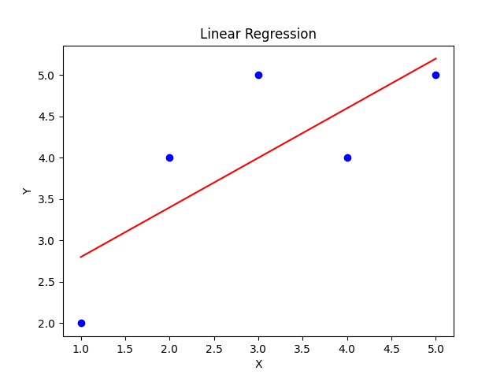
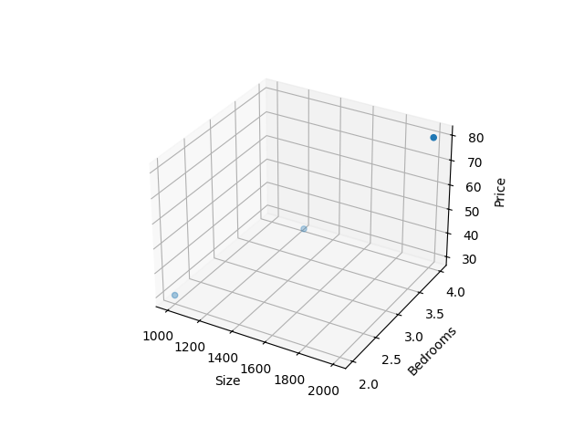

# Linear & Multiple Linear Regression Project

## Overview

This project demonstrates both Simple Linear Regression and Multiple Linear Regression to predict house prices.

---

## Dataset

### Simple Linear Regression

* Input: House size (sq.ft)
* Output: Price (in lakhs)

### Multiple Linear Regression

* Inputs:

  * Size (sq.ft)
  * Number of bedrooms
* Output: Price (in lakhs)

---

## Tech Stack

* Python
* Pandas
* Scikit-learn
* Matplotlib

---

## Models Implemented

### 1. Simple Linear Regression

* Equation: ŷ = mx + b
* Uses one feature (size)

### 2. Multiple Linear Regression

* Equation: ŷ = m₁x₁ + m₂x₂ + b
* Uses multiple features (size, bedrooms)

---

## Improvements

* Applied feature scaling using StandardScaler
* Compared feature importance using coefficients
* Implemented multi-feature prediction

---

## Results

### Simple Model

* MSE: ~2.3
* Prediction (1900 sq.ft): ~77 lakhs

### Multiple Model

* Prediction (1800 sq.ft, 3 bedrooms): ~68 lakhs

---

## Output

### Simple Linear Regression

### Multiple Linear Regression

---

## What I Learned

* Meaning of slope (m) and intercept (b)
* How prediction works (ŷ = mx + b)
* Extension to multiple inputs (m₁, m₂, ...)
* Feature scaling and its importance
* Model evaluation using MSE
* Difference between actual (Y) and predicted (ŷ)

---

## Future Improvements

* Add R² score for evaluation
* Work with larger datasets
* Implement more ML algorithms
